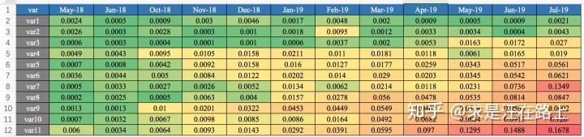

# 基础指标与策略

## 1.基础指标

风控简介:
风控是信贷的核心，它的主要目标是控制风险，使公司的利益最大化。在贷前、贷中和贷后均有重要作用。

* 在**贷前**包括准入门槛、反欺诈识别、信用评估、额度授信、贷前监控等事项；
* 在**贷中**包括额度管理、定价管理、营销管理、用户管理等事项；
* 在**贷后**包括早期催收、后期催收、催收工具、外包管理和贷后监控等事项。

**风险**：指的是互联网产品中存在的风险点，例如：

* 账户风险：垃圾注册账号、账号被泄露盗用
* 交易支付风险
  刷单：为提升卖家店铺人气，买卖家串通等方式虚假交易
  恶拍：恶意买家在卖家店铺频繁下单不支付；恶意买家通过频繁下单传播垃圾UGC等行为
  盗刷：买家卡被盗在平台上消费
  套现：伪装买卖家，在平台上信用卡交易，套出现金获利
* UGC风险
  风险类别：涉政、涉黄、涉爆等方面的文本、视频
  传播渠道：创建店铺、商品相关的标题，详情页；下单支付的备注留言；IM消息等

**控制：**预防、识别、控制风险的发生。风险的控制一般分为事前，事中，事后3个阶段处理。

* 识别及预防：一般风险行为和正常行为的行为链路会有所不同。通过分析用户的整个行为链路，可以将风险行为和正常行为区分开
* 事后控制：风险事件发生后，可以采取一定措施控制事件影响，例如用户套现，交易已经发生，但是可以通过控制提现时长或者冻结资金等方式来控制减小影响面

1.账龄（Month on Book, MOB）

​	含义：指资产放款月份

​	MOB0：放款日至当月月底

​	MOB1：放款日至第二个完整的月份

2.逾期天数（DPD）

​	逾期天数 = 实际还款日 - 应还款日

​	FPD：首次逾期

​	DPD30：逾期30天

3.逾期期数（M）

​	按期间划分的逾期时间

​	M0/C：当前未逾期

​	M1：逾期1-30日

​	M2：逾期31-60日

4.逾期率

​		两种口径：

​		订单口径：逾期率 = 逾期订单数 / 总放贷订单数

​		金额口径：逾期率 = 逾期剩余本金 / 总放贷本金

​		**面试问题：怎么看人数逾期和金额逾期**，答案见《面试题》

5.贷款余额（ENR）

至某时点借款人尚未偿还的本金，即：全部剩余本金作为贷款余额

6.WOE（证据权重）

​	计算：

​	

​	含义：通过WOE变化，特征值不仅代表了一个分类，还代表了分类的权重，**WOE越大，bad rate越高**

​	作用：将类别变量转为连续变量；或者对于连续变量，通过分箱变成类别变量，又通过WOE去“模拟”连续变量。

​	优点：

1. 把非线性的特征转换成线性；
2. 对波动不敏感。遇到异常数据亦能平稳表现

​	注：一般而言，对样本进行分箱之后，每个分箱的woe满足单调性（证明：两个）

7. **IV**

   作用：评估特征的预测能力

   计算：可以视为WOE的加权和

**7.KS:区分度评估指标**

​	，cum(bad_rate)：累计坏样本率

​	作用：评估模型区分度。通常来说，KS越大，表明正负样本区分程度越好。

​	计算步骤：

- **step 1**. 对变量进行分箱（binning），可以选择等频（每个箱的样本数相同）、等距，或者自定义距离。
- **step 2**. 计算每个分箱区间的好账户数(goods)和坏账户数(bads)。
- **step 3**. 计算每个分箱区间的累计好账户数占总好账户数比率(cum_good_rate)和累计坏账户数占总坏账户数比率(cum_bad_rate)。
- **step 4**. 计算每个分箱区间累计坏账户占比与累计好账户占比差的**绝对值**，得到KS曲线。也就是： ks=|cum_goodrate−cum_badrate|
- **step 5.** 在这些绝对值中**取最大值**，得到此变量最终的KS值。

​	KS表现不佳时的优化：

* 检验入模变量是否已经被策略使用，使用重复变量会导致区分度不高。
* 检验训练样本与验证样本之间的**客群差异**是否变化明显。
* 开发对目标场景更具针对性的**新特征**。比如，识别长期信用风险，就使用一些强金融属性变量；识别欺诈风险，就使用一些短期负面变量。
* 分群建模或分群测算。分群需要考虑稳定性和差异性。
* bad case分析，提取特征。

​	KS与ROC的关系:

**8.PSI指标**

​	作用：PSI反映了**验证样本**在各分数段（分箱）的分布与**建模样本**分布的稳定性

​	用法：用于筛选特征变量、评估模型的稳定性

​	计算：**PSI = SUM( (实际占比 - 预期占比）\* ln(实际占比 / 预期占比) )**，其中：

在建模时通常**以训练样本（In the Sample, INS）作为预期分布**，而**验证样本通常作为实际分布**。验证样本一般包括样本外（Out of Sample，OOS）和跨时间样本（Out of Time，OOT）。

- **step1**：将**变量预期分布**（excepted）进行**分箱**（binning）离散化，统计各个分箱里的样本占比。
  注意：
  a) 分箱可以是等频、等距或其他方式，分箱方式不同，将导致计算结果略微有差异；
  b) 对于**连续型**变量（特征变量、模型分数等），分箱数需要设置合理，一般设为10或20；对于离散型变量，如果分箱太多可以提前考虑合并小分箱；分箱数太多，可能会导致每个分箱内的样本量太少而失去统计意义；分箱数太少，又会导致计算结果精度降低。
- **step2**:按相同分箱区间，对**实际分布（actual）**统计各分箱内的样本占比**。**
- **step3**:计算各分箱内的**A - E**和**Ln(A / E)**，计算**index = (实际占比 - 预期占比）\* ln(实际占比 / 预期占比) 。**
- **step4**: 将各分箱的index进行求和，即得到最终的PSI。

​	在业务中的使用：

​	一般以训练集（INS）的样本分布作为预期分布，进而跨时间窗按月/周来计算PSI：

* 入模变量保证稳定性，变量监控

* 模型分数保证稳定性，模型监控

​	示例：

9.Lift指标

含义：衡量模型的提升度。**经过某种排序后**圈出来的坏人浓度，**相对于随机抽样**的坏人浓度的提升

计算：

**10.通过率和坏账率**

作用：评估模型的业务性能

## 2. 基础策略

**1.账龄分析（Vintage Analysis）**

​	含义：按账龄（MOB）长短对齐后比较，可以了解**同一产品不同时期**放款的资产质量，用于分析资产质量的变化规律，**用于确定合适的表现期（成熟期）**(即确定一个合适的表现期来覆盖足够多的坏用户)

​	作用：

1. **确定资产质量**：一般以逾期率来定义资产质量，也就是曲线平缓后对应的逾期率。
2. **分析变化规律**：资产质量（例如逾期率指标）的变化情况，如果前几期逾期率上升很快，那么说明短期风险没有捕捉住，欺诈风险较高；反之，如果曲线一直在上升，说明[信用风险识别能力不佳。
3. **确定账户成熟期**：用来判断客户展现好坏的时间因素，从而帮助定义表现期。
4. **分析影响因素**：风控策略收紧或放松、客群变化、市场环境、政策法规等都会影响资产质量。分析影响因素，可以用来指导风控策略的调整。

纵轴为逾期率，横轴为账龄

**2.滚动率分析（Roll Rate Analysis）**

滚动率分析就是从某个观察点之前的一段时间**（观察期）**的**最坏**的状态，向观察点之后的一段时间**（表现期）**的**最坏的**状态的发展变化情况

**作用：定义客户的好坏程度，定义一个阈值**

​		步骤：

​		滚动率分析的具体操作步骤为：

- **step 1.** 确定数据源。一般利用客户还款计划表（repayment schedule）。
- **step 2.** 选择观察点，以观察点为截止时间，统计客户在观察期（如过去6个月）的最长逾期期数，按最坏逾期状态将用户分为几个层次，如C、M1、M2、M3、M4+。
- **step 3.** 以观察点为起始时间，统计客户在表现期（如未来6个月）的最长逾期期数，按最坏逾期状态将用户分为几个层次，如C、M1、M2、M3、M4+。
- **step 4.** 交叉统计每个格子里的客户数，如图6中表1所示。
- **step 5.** 统计每个格子里的客户占比，如图6中表2所示。
- **step 6.** 为了排除观察点选择时的随机影响，一般会选择多个观察点。重复step1 ～5。

​                                                                                                                     滚动率分析矩阵

3.Vintage与滚动率结合分析

假设由Vintage得到成熟期（表现期）为MOB9，由滚动率分析得到逾期状态应该设置为M4+，则：

Bad = 账户经过9期表现期后，逾期状态为M4+的，Y = 1

Good = 账户经过9期表现期后，逾期状态未达到M4+的，Y = 0

**4.迁移率分析法（Flow Rate）/净流量滚动比例法**

作用：展示客户贷款账户在整个生命周期中的变化轨迹，用于**预测未来坏账损失**

**迁移率 = 前一期逾期金额到下一期逾期金额的转化率**

例：M0-M1 = 当月进入M1的贷款余额 / 上月末M0的贷款余额

迁移率分析的具体操作步骤为：

- **step 1.** 定义逾期状态，如前文所述的M0、M1、M2等。
- **step 2.** 计算各逾期状态之间的迁移率，如M0-M1、M2-M3等。
- **step 3.** 计算不同月份（也可称为Vintage）的平均迁移率。目的是对本平台在不同时期的资产的迁移率有整体的认知。
- **step 4.** 根据平均迁移率和不良资产回收率，计算净坏账损失率。

5.标签体系\客户画像

6.拒绝推断

https://zhuanlan.zhihu.com/p/88624987

问题背景：只用放贷样本建模，会导致样本出现偏差

解决的问题：假设对被拒绝的用户放贷，效果如何

验证指标：
1. 坏账率比较（Bad Rate）
2. 单变量分析：对入模变量分析WOE分箱的变化，主要检验**逻辑的合理性**。同时一般拒绝推断后IV将提升
3. 模型上线观察
