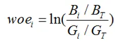
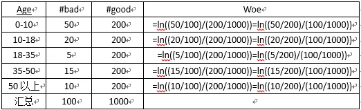
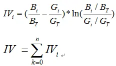
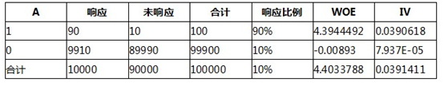

# 评分卡构建

流程：

1. 选择变量
2. 变量筛选
3. 变量处理
4. 构建评分卡
5. 模型优化
6. 模型检验

## 1. 选择变量

选择变量来对客户进行描述，贷中贷前贷后的表现、如逾期情况等

对于因变量，一般选舆情90天以上的客户标记为0（坏客户），其他为1（好客户）

## 2. 变量筛选

基于IV值进行筛选的方式。

IV的全称是Information Value，中文意思是信息价值，或者信息量。求IV值得先求woe值，这里又引入woe的概念。WOE的全称是“Weight of Evidence”，即证据权重。

首先把变量分组，然后对于每个组i，对于第i组有：

其中 是第i组坏客户数量（bad）， B是整体坏客户数量。同理，G就是good，好客户的意思。

woe反映的是在自变量每个分组下违约用户对正常用户占比和总体中违约用户对正常用户占比之间的差异；从而可以直观的认为woe蕴含了自变量取值对于目标变量（违约概率）的影响

而IV值得公式如下：

我们可以看到**IV值其实是woe值加权求和**。这个加权主要是消除掉各分组中数量差异带来的误差。

比如如果只用woe的绝对值求和，如果一些分组中，A组数量很小，B组数量很大（显然这样的分组不合理），这时B的woe值就很小，A组很大，求和的woe也不会小，显然这样不合理。比如：

最后我们可以根据每个变量IV值的大小排序去筛选变量。IV越大的越要保留.

## 3. 变量处理

变量离散化，用于输入logistics模型

## 4. 模型优化

根据KS值，横轴是总体累积率，纵轴是各样本（TPR,FPR）累积率

## 5. 模型检验

1.KS值

2.ROC曲线

3.交叉矩阵

4.Lift曲线

5.Gini系数

Lift=命中率/真实中正例的比例

横坐标Depth为预测成正例的比例

在模型中，随着改变阈值p，命中率会随之改变，lift曲线中横坐标就是改变阈值p下正比例的变化，纵坐标是lift提升度。比如命中率是80%，原来好坏比是1.1，那样就提高了1.6。

一般来说，在depth为1前，lift越大于1越好。

## 6. A卡（申请评分卡）

目的：为了识别获客阶段用户的逾期风险

准备阶段：

1. 定义样本观察点、观察期和表现其：
   * 观察点：授信日，指客户在此时提交申请资料，希望能获得金融机构授信资格
   * 观察期：授信日前的N个月。可根据在授信申请时采集的数据**构建相应特征X**
   * 表现期：客户在未来一段时间内表现出好坏的窗口（**定义Y的类别**）
2. 定义因变量Y：通过账龄分析和滚动率分析来确定

## 7.B卡（行为评分卡）

作用：根据借款人放贷后的行为表现，预测未来逾期风险

特征

参考资料：

https://www.secrss.com/articles/27699

A卡：https://zhuanlan.zhihu.com/p/137347716

B卡：https://zhuanlan.zhihu.com/p/109487237
